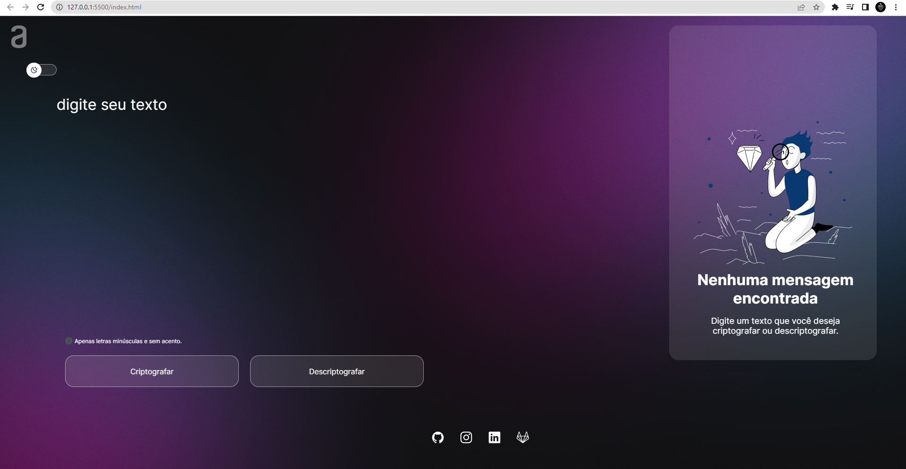
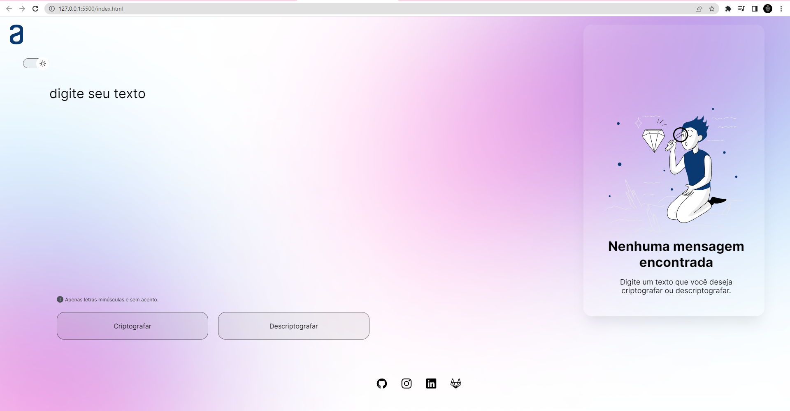

# Challenge Alura + Oracle
## Decodificador de texto com Javascript - em construção

Clique [AQUI](https://github.com/thiagofeldner/Decodificador-de-Texto) para acessar o projeto completo.
 
Clique [AQUI](https://thiagofeldner.github.io/Decodificador-de-Texto/) para acessar a página.

 

> ## 📝 Sobre o desafio
 

Desenvolver uma aplicação que criptografa textos.

 

🔑 As "chaves" de criptografia que utilizadas foram:
- A letra "e" é convertida para "enter"
- A letra "i" é convertida para "imes"
- A letra "a" é convertida para "ai"
- A letra "o" é convertida para "ober"
- A letra "u" é convertida para "ufat"

 

✅ Requisitos:

- Deve funcionar apenas com letras minúsculas
- Não devem ser utilizados letras com acentos nem caracteres especiais
- Deve ser possível converter uma palavra para a versão criptografada e também retornar uma palavra criptografada para a versão original

 

✨ Extra:
- Um botão que copie o texto criptografado
- Link das redes sociais

 

> ## 🖥️ Tecnologias
 

- HTML5
- CSS3
- JavaScript
- Figma
- Ion Icons
- Google Fonts